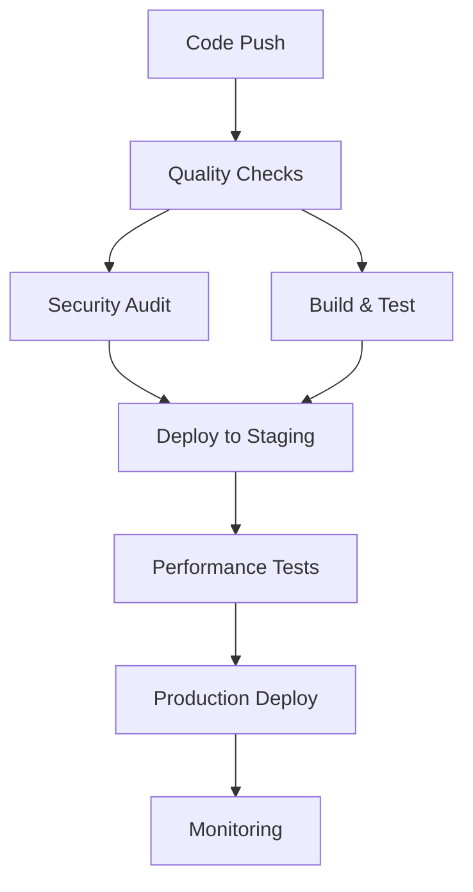

# CI/CD Pipeline Documentation

## 🚀 Automated CI/CD Pipeline for MusicPad

This document outlines the comprehensive CI/CD pipeline implemented for the MusicPad project using GitHub Actions.

## 📋 Pipeline Overview

### Workflow Files

1. **`.github/workflows/ci-cd.yml`** - Main CI/CD pipeline
2. **`.github/workflows/pr-checks.yml`** - Pull request validation
3. **`.github/workflows/release.yml`** - Automated releases

### Pipeline Stages



## 🔧 Setup Instructions

### 1. Repository Configuration

Enable the following in your GitHub repository settings:

- **Actions**: Enable GitHub Actions
- **Pages**: Configure for deployment
- **Secrets**: Add required secrets (see below)

### 2. Required Secrets

Add these secrets in GitHub Repository Settings > Secrets and variables > Actions:

```bash
# Required Secrets
GITHUB_TOKEN          # Automatically provided by GitHub
NPM_TOKEN             # For npm package publishing (if needed)
CODECOV_TOKEN         # For code coverage reporting
LHCI_GITHUB_APP_TOKEN # For Lighthouse CI performance testing
```

### 3. Branch Protection Rules

Configure branch protection for `main`:

- Require pull request reviews
- Require status checks to pass
- Require branches to be up to date
- Include administrators

## 🏗️ Build Process

### Development Build
```bash
npm run dev              # Start development server
npm run type-check       # TypeScript validation
npm run lint             # ESLint checks
npm run format:check     # Prettier formatting
```

### Production Build
```bash
npm run build           # Production build
npm run preview         # Preview production build
npm run test           # Run test suite
npm run test:coverage  # Generate coverage report
```

### Docker Build
```bash
npm run docker:build   # Build Docker image
npm run docker:run     # Run containerized app
```

## 🧪 Testing Strategy

### Unit Tests
- **Framework**: Vitest
- **DOM Testing**: @testing-library/react
- **Mocking**: Built-in Vitest mocks for Web Audio API

### Integration Tests
- **API Testing**: Test audio engine integration
- **Component Testing**: React component behavior
- **End-to-end**: Playwright for browser testing

### Performance Tests
- **Lighthouse CI**: Core Web Vitals monitoring
- **Bundle Analysis**: Size optimization checks
- **Audio Latency**: Real-time performance metrics

## 🚀 Deployment Pipeline

### Staging Environment
- **Trigger**: Merge to `develop` branch
- **URL**: `https://staging.musicpad.app`
- **Features**: Beta features, performance monitoring

### Production Environment
- **Trigger**: Merge to `main` branch
- **URL**: `https://musicpad.app`
- **Features**: Stable release, full monitoring

### Rollback Strategy
```bash
# Automatic rollback triggers
- Build failures
- Test failures
- Performance regression
- Security vulnerabilities
```

## 📊 Monitoring & Alerts

### Performance Monitoring
- **Core Web Vitals**: LCP, FID, CLS tracking
- **Audio Performance**: Latency, dropout monitoring
- **User Experience**: Error tracking, usage analytics

### Alert Configuration
```yaml
Performance Alerts:
  - LCP > 2.5s
  - FID > 100ms
  - Bundle size > 500KB
  
Error Alerts:
  - Error rate > 1%
  - Audio context failures
  - Build failures
```

## 🔒 Security Pipeline

### Automated Security Checks
- **npm audit**: Dependency vulnerability scanning
- **ESLint Security**: Code security patterns
- **OWASP**: Web application security testing

### Security Headers
```nginx
Content-Security-Policy: default-src 'self'; script-src 'self' 'unsafe-eval'
X-Content-Type-Options: nosniff
X-Frame-Options: SAMEORIGIN
X-XSS-Protection: 1; mode=block
```

## 📈 Release Management

### Semantic Versioning
- **Major**: Breaking changes (API changes)
- **Minor**: New features (new instruments, tools)
- **Patch**: Bug fixes, performance improvements

### Release Process
1. **Feature Development**: Work in feature branches
2. **Pull Request**: Code review and automated checks
3. **Staging**: Deploy to staging for testing
4. **Release**: Semantic release with changelog
5. **Production**: Automated deployment
6. **Monitoring**: Post-deployment monitoring

### Changelog Generation
Automated changelog based on conventional commits:
```
feat: add new synthesizer engine
fix: resolve audio context suspension issue
perf: optimize Web Audio buffer management
docs: update API documentation
```

## 🔧 Troubleshooting

### Common Issues

#### Build Failures
```bash
# Check logs
npm run build --verbose

# Clear cache
rm -rf node_modules dist .cache
npm install
```

#### Test Failures
```bash
# Run specific test
npm run test -- --run App.test.tsx

# Debug mode
npm run test -- --reporter=verbose
```

#### Deployment Issues
```bash
# Check GitHub Actions logs
# Verify secrets configuration
# Review branch protection rules
```

### Performance Issues
```bash
# Bundle analysis
npm run build
npx vite-bundle-analyzer dist

# Lighthouse audit
npm run preview
npx lighthouse http://localhost:4173
```

## 📚 Best Practices

### Code Quality
- Use TypeScript strictly
- Follow conventional commits
- Maintain test coverage >80%
- Keep bundle size optimized

### Deployment
- Never deploy directly to main
- Use feature flags for new features
- Monitor performance after deployment
- Maintain rollback capability

### Security
- Regular dependency updates
- Security headers implementation
- Audit third-party packages
- Monitor for vulnerabilities

## 🎯 Future Enhancements

### Pipeline Improvements
- Progressive Web App deployment
- Multi-environment testing
- A/B testing framework
- Advanced performance monitoring

### Security Enhancements
- Dependency scanning automation
- SAST/DAST integration
- Security compliance reporting
- Threat modeling automation

---

This CI/CD pipeline ensures **reliable, secure, and performant** deployments of the MusicPad application with comprehensive monitoring and quality assurance.